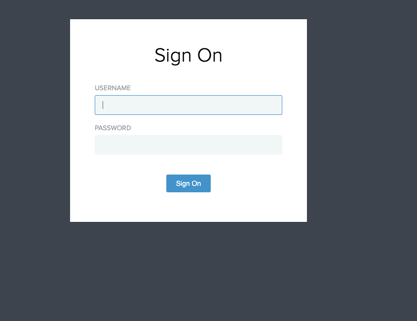

- When testing general PingFederate functionality, or validating metrics presented in Grafana it can useful to create a 'dummy' SSO connection to a website.  This document will detail how to manually setup this connection, as well as detailing the setup of SP and IDP connections.  
  
  There is also a video recording of this step by step process, from which this page is derived. [https://drive.google.com/file/d/1yFahE44qmGX1oa32PEU6eUdoBBYUYowf/view?usp=sharing](https://drive.google.com/file/d/1yFahE44qmGX1oa32PEU6eUdoBBYUYowf/view?usp=sharing)
  
  NOTE:
- Since this is a very step heavy guide, which mainly consists of navigating a complex multi-level UI, I have attempted to identify which overall page / tab you are on by **Bolding the name** i.e **Browser SSO**
- Any buttons / fields you need to click are usually identified by placing single quotes around the name of field/button.  I.e. click 'Map new adapter instance'.
- Feedback is welcome so please let me know if this format is good or bad.
## Step-by-step guide
- Navigate to the PingFederate admin portal for your CDE > [https://pingfederate-admin.test-dragonet.us1.ping-preview.cloud/](https://pingfederate-admin.test-dragonet.us1.ping-preview.cloud/pingfederate/app?service=page/ReactHome#/Authentication)
- Go to **Applications > SP Connections > Create Connection
  
  **
- Click next until you get to **Connection Type**, select the box for '**Browser SSO Profiles**', keep clicking next until you get to **General Info
  
  **
- For '**Partners Entity ID**', '**Connection Name**', and **'Virtual Server IDs**', enter any name. I used "SSO", be sure to add in the virtual server ID not just enter the string in the box
- For '**Base URL**' enter your PF runtime URL >  [https://pingfederate.test-dragonet.us1.ping-preview.cloud](https://pingfederate-admin.test-dragonet.us1.ping-preview.cloud/pingfederate/app?service=page/ReactHome#/Authentication), click 'next' to **Browser SSO
  
  **
- Click '**Configure Browser SSO**', check the radio boxes for **'IDP-Initiated SSO'** and '**IDP-Initiated SLO**', click next until you get to **Assertion Creation** tab
- Click '**Configure Assertion Creation**', click next until you get to **Authentication Source Mapping** tab, click '**Map New Adapter Instance**' > '**Manage Adapter Instances**' > '**Create New Instance**'
- Instance name can be whatever you want, I entered "testspadapter" for '**Instance Name**' and '**Instance ID**'. For '**type**' select **HTML Form IdP Adapter**.  Next
- Click '**Add new row to Credential Validators**', from the dropdown select PingDirectory, and click the '**Update**' button on the far right.  Next until you get to **Adapter Attributes**, check the '**Pseudonym**' column for **username**, next until you can **save **and** exit** the IDP adapter creation dialogue.  You should see your new IdP adapter listed under '**Instance Name**'.  Click '**Done**'.
- You should be in the **IdP Adapter Mapping** still.  Using the dropdown for adapter instance **select** your newly created SP adapter.  Then **click next** until you get to **Attribute Contract Fulfillment**. For SAML_SUBJECT source drop down to **Adapter**, for value **select username**.  Click **Next **until you get to summary, then **Done**.
- You're now in **Assertion Creation**, click **Next**, **Done**.
- You are now in **Browser SSO**, **next** to get to the **Protocol Settings** tab, then '**Configure Protocol Settings**'
- Start by clicking the **question mark** in the **top right corner of PF UI**, **click SP Endpoints** and **wait for the pop up screen**.  **Grab the value **for **POST** under **Assertion Consumer Service**, it should look like '/sp/ACS.saml2'.
- For '**Binding**', **select POST** from the dropdown, then **paste the endpoint URL** from the last step. **Add **this entry before clicking **Next**.
- Repeat the process, for **Binding select POST**, **endpoint URL** return to the popup screen, this time selecting the endpoint/url for **POST** under **SLO Service**, **paste** that in the **endpoint URL** section, **add**, then **next** until you get to **Allowable SAML Bindings
  
  **
- **Uncheck** the **Artifact** and **SOAP** boxes, **next** until you get to **Summary**, **done**.
- Now you're in **Browser SSO** again, **next** until **done**.
- Keep **clicking next** until you are back in the **SP connection** page at the **C****redentials** tab.  Click '**Configure Credentials**'
- Click '**Manage Certificates**' > '**Create new**', enter anything you want for name, I chose 'test'.  Organization is Ping, country is US.  Next
- **Save** the certificate, and on the right side '**Action**' dropdown be sure to **export**.  When exporting select **certificate only**, **next**, **export**.  A cert file should be downloaded to your machine.  Click **Done**.
- Click **next** until you get to the **Signature Verification Settings** tab of the **Credentials **page.  Click '**Manage Signature Verification Settings**', **next**, s**elect manage certificates**, and **import **the file downloaded from the last step by selecting '**Manage Certificates**' > '**Add**'.
- **Choose the file** from your computer,  click** next**, and **save**, then **Done**.
- Keep **clicking next/done** till you are presented with a **Summary **page and click **done**.  You have now created your SP connection
- Now we need to create an IdP connection.  Navigate to **Authentication** > **IdP Connections** > **Create connections**.  Most of this is the same just 'from the other side'
- Check '**Browser SSO Profiles**' like before, **next**, until you get to **General Info** tab
- Use the same labels for **Entity ID,** **name**, and **Virtual Server ID** as you did in the **SP connections**, these **must match**. Click **next **to **Configure Browser SSO**.
- Again **check IDP-Initiated SSO**, as well as **IDP-Initiated SLO**, next to **User-Session-Creation**.  Click '**Configure User-Session Creation**'
- Next until you get to** Target Session Mapping.**  Click '**Map New Adapter Instance**' > '**Manage Adapter Instances**' > '**Create New Instance**'.
- For instance name it can be anything, as with the SP adapter.  I chose testidpadapter for name and instance ID.  Type is **OpenToken SP Adapter**. **Next**
- For password, it can be anything that satisfies the minimum requirements, I chose **2FederateM0re**.  **Next** until you get to **Summary,** **done** and **save**.
- You should now have a new adapter, **select this adapter** in the '**Adapter Instance**' dropdown of the **Adapter Mapping & User Lookup** tab.  **Next** until you get to **Adapter Contract Fulfillment
  
  **
- For value of '**subject**' select '**Assertion**', for the value select '**SAML_Subject**', **next** till you get to **Summary**, **done**.
- You are returned to **User-Session Creation**, click next and done to return to **Browser SSO
  
  **
- When you get back to the **Browser SSO** screen, click next until you get to **Protocol settings**, then click  '**Configure Protocol Settings**'
- Similar steps here as before, for binding select **'POST'**, get the endpoint URL by clicking the '**?**' in the top right, and **selecting IDP endpoints**, copy and paste the value for POST under SSO Service.  Looks like /idp/SSO.saml2.  Don't forget to add the binding before clicking **next**.
- **Uncheck** the boxes for **Artifact** and **SOAP**.  **Next**
- Set the **default target URL **as the URL you would like to be redirected to when SSO succeeds.  I chose [https://pingidentity.com](https://pingidentity.com/).  Click next until you get to **Summary**, click **Done**.
- You are returned back to **Browser SSO** screen, continue clicking next until you can click done.
- You are at the **IdP Connection** screen, under the **Credentials** Tab.  Click '**Configure Credentials**'
- Click the dropdown for signing certificate and **select the cert **that we used 'on the other side' in SP connections.  Next
- Click '**Manage Signature Verification Settings**', click **next **until you get to **Signature Verification Credentials**, and click '**Manage Certificates**'.  Import the .crt file we downloaded in previous steps.
- Click **Next** > **Save** > **Done**, and keep doing so until you are brought back out of the entire **IdP connection** creation process.
## API-Heavy Alternative Guide
- Navigate to [https://<target system url>/pf-admin-api/api-docs](https://pingfederate-admin-eks.single.ray.ping-demo.com/pf-admin-api/api-docs) Eg: [https://pingfederate-admin.dev-frog.us1.ping-preview.cloud/pf-admin-api/api-docs](https://pingfederate-admin.dev-frog.us1.ping-preview.cloud/pf-admin-api/api-docs/).
- Go to /version and Get from it to confirm you are authorized and logged in to PF
- Navigate to **/keyPairs/signing** and paste the following in the POST **/keyPairs/signing/generate** request box:
  
  **/keyPairs/signing/generate**
  
  | 
  
  `{`
  
  `    ``"id"``: ``"5ju1t9nwlh84fdg93h6nm3764"``,`
  
  `    ``"commonName"``: ``"test"``,`
  
  `    ``"subjectAlternativeNames"``: [],`
  
  `    ``"organization"``: ``"Ping"``,`
  
  `    ``"country"``: ``"US"``,`
  
  `    ``"validDays"``: 365,`
  
  `    ``"keyAlgorithm"``: ``"RSA"``,`
  
  `    ``"keySize"``: 2048,`
  
  `    ``"signatureAlgorithm"``: ``"SHA256withRSA"`
  
  `}`
  
   |
- Save the response body to some notes on your PC, we will need it later
- Navigate to **/keyPairs/signing** and execute GET **/keyPairs/signing/{id}/certificate** request with id = 5ju1t9nwlh84fdg93h6nm3764(the same id that was used in step 3 for cert generation). Save the response body to some notes on your PC, we will need it later.
- Navigate to **/idp/adapters.** Paste the following in the POST request box and change <PF_admin_URL> to your cluster PF-admin url (e.g. https://pingfederate-admin.dev-frog.us1.ping-preview.cloud):
  
  **/idp/adapter** Expand source
  
  Hit Try it Out!
- Next Navigate to **/idp/spConnections. **Paste the following into the POST request box and made a few changes:
  -  change <PF_engine_URL> to pf-engine URL of your cluster (e.g. https://pingfederate.dev-frog.us1.ping-preview.cloud)
- change <PF_admin_URL> to pf-admin URL of your cluster (e.g. https://pingfederate-admin.dev-frog.us1.ping-preview.cloud)
  -  change <CERT_ID> to 5ju1t9nwlh84fdg93h6nm3764(the same id that was used in step 3 for cert generation)
  -  change <CERT_VIEW> to the response body from steps 3-4
  -  change <FILE_DATA> to the response body from step 5
  
  **spConnection** Expand source
  
  Hit Try it Out!
- Next Navigate to **/sp/adapters. **Paste the following in the POST request box and change <PF_admin_URL> to your cluster PF-admin url (e.g. https://pingfederate-admin.dev-frog.us1.ping-preview.cloud):
  
  **/sp/adapter** Expand source
  
  Hit Try it Out!
- Paste the following into the POST request box and made a few changes:
  -  change <PF_engine_URL> to pf-engine URL of your cluster (e.g. https://pingfederate.dev-frog.us1.ping-preview.cloud)
- change <PF_admin_URL> to pf-admin URL of your cluster (e.g. https://pingfederate-admin.dev-frog.us1.ping-preview.cloud)
  -  change <CERT_ID> to 5ju1t9nwlh84fdg93h6nm3764(the same id that was used in step 3 for cert generation)
  -  change <CERT_VIEW> to the response body from steps 3-4
  -  change <FILE_DATA> to the response body from step 5
  
  **idpConnection** Expand source
  
  Hit Try it Out!
- Return to the PF Admin UI and Replicate Configuration.
## Replicate and Test
- Replicate configuration by going to System > server > cluster management > replicate configuration
- Navigate back to Applications > SP connections > click 'your-sp-connection' > SSO.  At the top you should see a 'SSO Application Endpoint' that looks like the URL you entered as your redirect URL (i.e. pingidentity.com).  Click the link and you should be brought to a familiar Ping login screen
- {:height 403, :width 499}
-
- Follow steps [here](https://confluence.pingidentity.com/display/PDA/Add+Test+Users+to+PingDirectory) to add users to PingDirectory.  You only need one user to test, just be sure to add under correct search base / user_base_dn.  For SQE, we would like to override the default of 'dc=example,dc=com', and instead add users under the base DN of 'dc=testname,dc=com"
- Go back to your SSO login screen, try entering the correct username and password for the user you added to PD.  If everything is setup correctly you should be 'authenticated' and redirected to the PingID home screen.
- **Optional: Set up adapter to adapter mapping (Grafana testing)**
- Go to Applications > Integrations > Adapter-to-adapter mappings.  Select your SP and IdP adapters for source and target instance, respectively.  Click 'Add Mapping'
- Click net until you get to Adapter Contract Fulfillment tab, for source select 'Adapter. Value select Username.  Click Next
- Under default target URL tab, paste in the same URL you used earlier I.e. [https://pingidentity.co](https://pingidentity.com/)m.  Keep clicking next until you are returned to the initial screen
- Replicate configuration